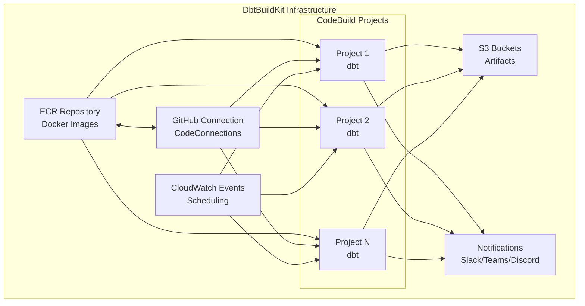

<div align="center">
  
</div>

<div align="center">

# DbtBuildKit Infrastructure

**Build workspaces for dbt projects automatically and entirely on AWS**


[](https://dbtbuildkit.github.io/dbtbuildkit-infra/)
[](./VERSION)

</div>

---

## Table of Contents

- [Purpose](#purpose)
- [Key Features](#key-features)
- [Architecture](#architecture)
- [Prerequisites](#prerequisites)
- [Quick Start](#quick-start)
- [Project Structure](#project-structure)
- [Automatic CI/CD Setup](#automatic-cicd-setup)
- [Documentation](#documentation)
- [Examples](#examples)
- [Version](#version)

---

## Purpose

**DbtBuildKit** eliminates infrastructure complexity for data teams. Instead of wasting time configuring ECR, GitHub connections, CI/CD pipelines, IAM permissions, and monitoring, you simply define your dbt project and DbtBuildKit automatically provisions all necessary infrastructure on AWS.

**Your team can focus 100% on what really matters: developing and maintaining dbt projects.**

---

## Key Features

### `dbtbuildkit` Module
- **Automatic ECR repository creation** with optimized configurations
- **Native GitHub integration** via AWS CodeConnections
- **Automatic Docker image builds** with pre-configured DbtBuildKit
- **Automatic GitHub connection approval** with configurable timeout
- **Lifecycle policies** for image management
- **Security scanning** of images on push
- **Self-contained module** - all logic integrated, no external dependencies

### `dbt` Module
- **Automatic CodeBuild project creation** based on YAML file
- **Multi-environment support** (dev, stg, prd)
- **Execution scheduling** via CloudWatch Events (cron and rate)
- **Native GitHub integration** or SSH as fallback
- **Multiple engine support**: Athena, Redshift, BigQuery, Snowflake, etc.
- **Multi-channel notifications**: Slack, Microsoft Teams, Discord
- **Elementary Data integration** for advanced monitoring
- **Incident management** via AWS Systems Manager
- **Configurable IAM permissions** (minimal or broad policies)
- **VPC support** for private network execution
- **Environment variables** and AWS Secrets Manager secrets
- **Configurable S3 artifacts**
- **Customizable timeout and compute type**

---

## Architecture

DbtBuildKit automatically provisions a complete infrastructure on AWS:



### Execution Flow

1. **Provisioning**: Terraform creates ECR, GitHub Connection, and CodeBuild projects
2. **Build**: Docker image is built and pushed to ECR automatically
3. **Scheduling**: CloudWatch Events triggers executions according to configuration
4. **Execution**: CodeBuild executes dbt commands using the Docker image
5. **Notifications**: Results are sent to configured channels
6. **Monitoring**: Elementary Data and CloudWatch logs for observability

---

## Prerequisites

Before starting, make sure you have:

- **AWS Account** with adequate permissions to create resources
- **Terraform** installed (version >= 1.0)
- **AWS CLI** configured with valid credentials
- **GitHub access** (organization or repositories)
- **Basic knowledge** of Terraform and dbt (optional, but recommended)

### Required AWS Permissions

The user/role running Terraform needs permissions for:
- ECR (create repositories, push/pull images)
- CodeBuild (create projects, roles, policies)
- CodeConnections (create GitHub connections)
- IAM (create roles and policies)
- CloudWatch Events (create scheduling rules)
- S3 (create buckets for artifacts)
- Secrets Manager (if using secrets)

---

## Quick Start

> **Note:** You can now configure CI/CD automatically using GitHub Actions! See the [Automatic CI/CD Setup](#-automatic-cicd-setup) section below.

### Option 1: Automatic CI/CD Setup (Recommended)

DbtBuildKit now includes reusable GitHub Actions workflows that automatically configure all CI/CD infrastructure for you. This is the fastest and easiest way to get started.

#### Step 1: Configure GitHub Secrets

Go to **Settings > Secrets and variables > Actions** and add:

**Required Secrets:**
- `AWS_ACCOUNT_ID`: AWS Account ID (REQUIRED for all workflows)
- `AWS_ACCESS_KEY_ID`: AWS Access Key ID (REQUIRED for setup-cicd.yml)
- `AWS_SECRET_ACCESS_KEY`: AWS Secret Access Key (REQUIRED for setup-cicd.yml)

**Optional Secrets (for setup-cicd.yml):**
- `AWS_POLICY_ARN`: ARN of custom IAM policy to attach to the created role (optional, uses default policy if not provided)
- `AWS_SECRET_TOKEN`: AWS Session Token (optional, required for SSO/temporary credentials)

**Note:** 
- If `AWS_POLICY_ARN` is not provided, a default policy optimized for dbt projects CI/CD will be automatically created
- If you're using SSO/temporary credentials, you must also provide `AWS_SECRET_TOKEN` along with `AWS_ACCESS_KEY_ID` and `AWS_SECRET_ACCESS_KEY`

#### Step 2: Use Reusable Workflows

Create a `.github/workflows/cicd.yml` file in your repository and use the reusable workflows:

```yaml
jobs:
  setup-cicd:
    uses: dbtbuildkit/dbtbuildkit-infra/.github/workflows/setup-cicd.yml@main
    with:
      environment: 'dev'
      aws_region: 'us-east-1'
    secrets:
      AWS_ACCOUNT_ID: ${{ secrets.AWS_ACCOUNT_ID }}
      AWS_ACCESS_KEY_ID: ${{ secrets.AWS_ACCESS_KEY_ID }}
      AWS_SECRET_ACCESS_KEY: ${{ secrets.AWS_SECRET_ACCESS_KEY }}
      AWS_SECRET_TOKEN: ${{ secrets.AWS_SECRET_TOKEN }}
      AWS_POLICY_ARN: ${{ secrets.AWS_POLICY_ARN }}

  ci:
    needs: setup-cicd
    uses: dbtbuildkit/dbtbuildkit-infra/.github/workflows/ci.yml@main
    with:
      environment: 'dev'
      aws_region: 'us-east-1'
    secrets:
      AWS_ACCOUNT_ID: ${{ secrets.AWS_ACCOUNT_ID }}

  cd:
    needs: [setup-cicd, ci]
    if: github.ref == 'refs/heads/main'
    uses: dbtbuildkit/dbtbuildkit-infra/.github/workflows/cd.yml@main
    with:
      environment: 'dev'
      aws_region: 'us-east-1'
    secrets:
      AWS_ACCOUNT_ID: ${{ secrets.AWS_ACCOUNT_ID }}
```

The workflow will automatically:
- Check if infrastructure exists
- Create S3 bucket for Terraform state (if needed)
- Create IAM Role for GitHub Actions following the pattern: `github-actions-role-${AWS_ACCOUNT_ID}-${AWS_REGION}`
- Attach the provided IAM Policy to the created role
- Create OIDC Provider for authentication (if needed)

#### Step 3: Use CI/CD Workflows

After setup, use the reusable workflows in your CI/CD pipeline. See complete example in `.github/workflows/example-user-workflow.yml`.

---

### Option 2: Manual Setup

### 1. Clone the Repository

```bash
git clone https://github.com/dbtbuildkit/dbtbuildkit-infra.git
cd dbtbuildkit-infra
```

### 2. Configure Terraform Backend

Create a `backend.tf` file (see example in `example/backend.tf`):

```hcl
terraform {
  backend "s3" {
    bucket = "your-terraform-state-bucket"
    key    = "dbtbuildkit/terraform.tfstate"
    region = "us-east-1"
  }
}
```

### 3. Configure Variables

Create a `terraform.tfvars` file:

```hcl
aws_region        = "us-east-1"
env               = "dev"
project           = "my-project"
github_organization = "my-org"

tags = {
  env              = "dev"
  project          = "my-project"
  owner            = "data-team@example.com"
  data_sensitivity = "Internal"
  purpose          = "ETL_Process"
}
```

### 4. Use the Modules

Create a `main.tf` file:

```hcl
# Module to create ECR and GitHub Connection
module "dbtbuildkit" {
  source = "git::https://github.com/dbtbuildkit/dbtbuildkit-infra.git//dbtbuildkit?ref=main"
  
  project            = var.project
  env                = var.env
  aws_region         = var.aws_region
  github_organization = var.github_organization
  tags               = var.tags
}

# Module to create CodeBuild projects
module "dbt_projects" {
  source = "git::https://github.com/dbtbuildkit/dbtbuildkit-infra.git//dbt?ref=main"
  
  project              = var.project
  env                  = var.env
  aws_region           = var.aws_region
  github_connection_arn = module.dbtbuildkit.github_connection_arn
  tags                 = var.tags
  
  depends_on = [module.dbtbuildkit]
}
```

### 5. Configure dbt Projects

Create a `codebuild-config.yml` file (see complete example in `example/codebuild-config.yml`):

```yaml
codebuild:
  - name: my-dbt-project
    active: true
    org: my-org
    repo: my-dbt-repo
    engine: athena
    commands:
      - dbt deps
      - dbt build
    s3_artifacts_bucket: "my-artifacts-bucket"
```

### 6. Apply Infrastructure

```bash
terraform init
terraform plan
terraform apply
```

> **Note:** If using `wait_for_connection_approval = true`, you will need to approve the GitHub connection in the AWS console before Terraform continues.

---

## Project Structure

```
.
├── dbtbuildkit/          # Module for ECR and GitHub Connections
│   ├── main.tf           # Main resources (ECR + GitHub)
│   ├── variables.tf      # Module variables
│   ├── outputs.tf        # Module outputs
│   ├── docker/           # Dockerfile and configurations
│   └── scripts/          # Helper scripts
│
├── dbt/                  # Module for CodeBuild projects
│   ├── main.tf           # CodeBuild resources
│   ├── variables.tf      # Module variables
│   ├── outputs.tf        # Module outputs
│   ├── buildspec.tpl     # Buildspec template
│   └── scripts/          # Validation scripts
│
├── docs/                 # Sphinx documentation
│   ├── conf.py          # Sphinx configuration
│   ├── index.rst        # Documentation index
│   ├── cicd.rst         # CI/CD setup documentation
│   ├── modules/         # Module documentation
│   └── examples.rst     # Usage examples
│
├── example/              # Practical examples
│   ├── main.tf          # Module usage example
│   ├── backend.tf       # Backend example
│   ├── variables.tf     # Example variables
│   └── codebuild-config.yml  # Example configuration
│
├── .github/workflows/   # Reusable GitHub Actions Workflows
│   ├── setup-cicd.yml  # Automatic CI/CD infrastructure setup
│   ├── ci.yml  # Reusable workflow: terraform plan
│   ├── cd.yml  # Reusable workflow: terraform apply
│   └── example-user-workflow.yml  # Complete usage example
│
├── README.md            # This file
└── VERSION              # Current project version
```

---

## Automatic CI/CD Setup

DbtBuildKit includes reusable GitHub Actions workflows that automatically configure all CI/CD infrastructure. This feature eliminates the need to manually configure S3 buckets, IAM roles, and OIDC providers.

### How It Works

1. **Initial Setup Workflow**: Automatically configures all base infrastructure (S3, IAM, OIDC)
2. **Reusable Workflows**: Ready-to-use workflows for your CI/CD (plan, apply)
3. **Secure Authentication**: Uses OIDC for GitHub → AWS authentication (no permanent credentials needed)

### Features

- **Automatic setup** of base infrastructure
- **Reusable workflows** for Terraform (plan, apply)
- **Multi-environment support** (dev, stg, prd)
- **OIDC authentication** (no permanent credentials)
- **Ready-to-use examples**

### Quick Start

#### Step 1: Configure GitHub Secrets

Go to **Settings > Secrets and variables > Actions** and add:

**Required Secrets:**
- `AWS_ACCOUNT_ID`: AWS Account ID (REQUIRED for all workflows)
- `AWS_ACCESS_KEY_ID`: AWS Access Key ID (REQUIRED for setup-cicd.yml)
- `AWS_SECRET_ACCESS_KEY`: AWS Secret Access Key (REQUIRED for setup-cicd.yml)

**Optional Secrets (for setup-cicd.yml):**
- `AWS_POLICY_ARN`: ARN of custom IAM policy to attach to the created role (optional, uses default policy if not provided)
- `AWS_SECRET_TOKEN`: AWS Session Token (optional, required for SSO/temporary credentials)

**Note:** 
- If `AWS_POLICY_ARN` is not provided, a default policy optimized for dbt projects CI/CD will be automatically created
- If you're using SSO/temporary credentials, you must also provide `AWS_SECRET_TOKEN` along with `AWS_ACCESS_KEY_ID` and `AWS_SECRET_ACCESS_KEY`

#### Step 2: Use Reusable Workflows in Your Repository

Create a `.github/workflows/cicd.yml` file in your repository:

```yaml
name: CI/CD Pipeline

on:
  push:
    branches: [main]
  pull_request:
    branches: [main]

jobs:
  setup-cicd:
    uses: dbtbuildkit/dbtbuildkit-infra/.github/workflows/setup-cicd.yml@main
    with:
      environment: 'dev'
      aws_region: 'us-east-1'
    secrets:
      AWS_ACCOUNT_ID: ${{ secrets.AWS_ACCOUNT_ID }}
      AWS_ACCESS_KEY_ID: ${{ secrets.AWS_ACCESS_KEY_ID }}
      AWS_SECRET_ACCESS_KEY: ${{ secrets.AWS_SECRET_ACCESS_KEY }}
      AWS_SECRET_TOKEN: ${{ secrets.AWS_SECRET_TOKEN }}
      AWS_POLICY_ARN: ${{ secrets.AWS_POLICY_ARN }}

  ci:
    needs: setup-cicd
    uses: dbtbuildkit/dbtbuildkit-infra/.github/workflows/ci.yml@main
    with:
      environment: 'dev'
      aws_region: 'us-east-1'
    secrets:
      AWS_ACCOUNT_ID: ${{ secrets.AWS_ACCOUNT_ID }}

  cd:
    needs: [setup-cicd, ci]
    if: github.ref == 'refs/heads/main'
    uses: dbtbuildkit/dbtbuildkit-infra/.github/workflows/cd.yml@main
    with:
      environment: 'dev'
      aws_region: 'us-east-1'
      auto_approve: true
    secrets:
      AWS_ACCOUNT_ID: ${{ secrets.AWS_ACCOUNT_ID }}
```

**Note:** Replace `dbtbuildkit/dbtbuildkit-infra` with your DbtBuildKit repository path.

### Available Workflows

#### `setup-cicd.yml` - CI/CD Infrastructure Setup

Automatically checks if CI/CD infrastructure exists and creates it if needed.

**Inputs:**
- `environment` (optional): Environment (dev, stg, prd) - default: 'dev'
- `aws_region` (optional): AWS region - default: 'us-east-1'

**Secrets:**
- `AWS_ACCOUNT_ID` (required): AWS Account ID
- `AWS_ACCESS_KEY_ID` (required): AWS Access Key ID
- `AWS_SECRET_ACCESS_KEY` (required): AWS Secret Access Key
- `AWS_SECRET_TOKEN` (optional): AWS Session Token (required for SSO/temporary credentials)
- `AWS_POLICY_ARN` (optional): ARN of custom IAM policy to attach to the created role (uses default policy if not provided)

#### `ci.yml` - Terraform Plan

Runs `terraform plan` for review.

**Inputs:**
- `environment` (required): Environment (dev, stg, prd)
- `aws_region` (optional): AWS region - default: 'us-east-1'
- `terraform_directory` (optional): Terraform directory - default: '.'
- `terraform_version` (optional): Terraform version - default: '1.6.0'

**Secrets:**
- `AWS_ACCOUNT_ID` (required): AWS Account ID (used to construct the IAM role ARN following the pattern: `github-actions-role-${AWS_ACCOUNT_ID}-${AWS_REGION}`)

#### `cd.yml` - Terraform Apply

Runs `terraform apply` to provision infrastructure.

**Inputs:**
- `environment` (required): Environment (dev, stg, prd)
- `aws_region` (optional): AWS region - default: 'us-east-1'
- `terraform_directory` (optional): Terraform directory - default: '.'
- `terraform_version` (optional): Terraform version - default: '1.6.0'
- `auto_approve` (optional): Auto approve apply - default: false

**Secrets:**
- `AWS_ACCOUNT_ID` (required): AWS Account ID (used to construct the IAM role ARN following the pattern: `github-actions-role-${AWS_ACCOUNT_ID}-${AWS_REGION}`)

### Documentation

For more details on how to configure and use automatic CI/CD, see:

**[Complete CI/CD Setup Guide](.github/workflows/README.md)**
**[Usage Example](.github/workflows/example-user-workflow.yml)**

---

## Documentation

For complete information on how to use modules, variables, outputs, and examples, see the official documentation:

### [Online Documentation on GitHub Pages](https://dbtbuildkit.github.io/dbtbuildkit-infra/)

> **Note:** If the documentation is not available at the link above, check the GitHub Pages settings in the repository or see the local documentation in `docs/`.

### Documentation Content

The documentation includes:
- **Usage guide** for `dbtbuildkit` and `dbt` modules
- **Complete reference** of variables and outputs
- **Practical examples** of implementation
- **Advanced configurations** and use cases
- **Troubleshooting** and frequently asked questions
- **CI/CD setup guide** for automatic infrastructure setup

### Generating Documentation Locally

```bash
cd docs
pip install -r requirements.txt
make html
# Open docs/_build/html/index.html in your browser
```

---

## Examples

### GitHub Actions Workflow Example

To use DbtBuildKit in your repository, create a `.github/workflows/cicd.yml` file:

```yaml
name: CI/CD Pipeline

on:
  push:
    branches: [main]
  pull_request:
    branches: [main]

jobs:
  setup-cicd:
    uses: dbtbuildkit/dbtbuildkit-infra/.github/workflows/setup-cicd.yml@main
    with:
      environment: 'dev'
      aws_region: 'us-east-1'
    secrets:
      AWS_ROLE_ARN: ${{ secrets.AWS_ROLE_ARN }}

  ci:
    needs: setup-cicd
    uses: dbtbuildkit/dbtbuildkit-infra/.github/workflows/ci.yml@main
    with:
      environment: 'dev'
      aws_region: 'us-east-1'
    secrets:
      AWS_ROLE_ARN: ${{ secrets.AWS_ROLE_ARN }}

  cd:
    needs: [setup-cicd, ci]
    if: github.ref == 'refs/heads/main'
    uses: dbtbuildkit/dbtbuildkit-infra/.github/workflows/cd.yml@main
    with:
      environment: 'dev'
      aws_region: 'us-east-1'
      auto_approve: true
    secrets:
      AWS_ROLE_ARN: ${{ secrets.AWS_ROLE_ARN }}
```

**For more examples:** See `.github/workflows/example-user-workflow.yml` or the [CI/CD Documentation](docs/cicd.rst)

---

## Configuration Examples

### Basic Example

Simple dbt project with manual execution:

```yaml
codebuild:
  - name: basic-project
    active: true
    org: my-org
    repo: my-dbt-repo
    engine: athena
    commands:
      - dbt deps
      - dbt build
    s3_artifacts_bucket: "my-bucket"
```

### Scheduled Example

Project with daily scheduled execution:

```yaml
codebuild:
  - name: scheduled-project
    active: true
    org: my-org
    repo: my-dbt-repo
    engine: redshift
    commands:
      - dbt run --select tag:daily
      - dbt test
    schedule: "cron(0 2 * * ? *)"  # Daily at 2 AM UTC
    timeout: 120
```

### Complete Example

Project with all features:

```yaml
codebuild:
  - name: complete-project
    active: true
    org: my-org
    repo: my-dbt-repo
    engine: redshift
    commands:
      - dbt run
      - dbt test
      - dbt docs generate
    
    # Scheduling
    schedule: "cron(0 3 * * ? *)"
    timeout: 180
    compute_type: BUILD_GENERAL1_MEDIUM
    
    # Notifications
    slack-notification:
      active: true
      channel: "#data-alerts"
      secret_name: "slack-token"
    
    # Elementary Data
    elementary:
      active: true
      channel: "#elementary-data"
      gitpages: true
    
    # Incident Management
    incident-manager:
      active: true
      impact: 1
      incident-response-plan: "data-response-plan"
    
    # Environment Variables and Secrets
    environment_variables:
      LOG_LEVEL: "INFO"
    secrets_manager_variables:
      - DB_PASSWORD: "arn:aws:secretsmanager:us-east-1:123456789012:secret:db-password"
```

For more examples, see:
- Complete file: `example/codebuild-config.yml`
- Documentation: [Examples in Documentation](https://dbtbuildkit.github.io/dbtbuildkit-infra/examples.html)

---

## 🔖 Version

**Current version:** `0.1.0`

See the [VERSION](./VERSION) file for the latest version.

---

## 🤝 Contributing

Contributions are welcome! To contribute:

1. Fork the repository
2. Create a branch for your feature (`git checkout -b feature/new-feature`)
3. Commit your changes (`git commit -m 'Add new feature'`)
4. Push to the branch (`git push origin feature/new-feature`)
5. Open a Pull Request

---

## 📝 License

This project is licensed under the MIT License. See the [LICENSE](LICENSE) file for more details.

---

## Support

- **Documentation**: [GitHub Pages](https://dbtbuildkit.github.io/dbtbuildkit-infra/)
- **Issues**: [GitHub Issues](https://github.com/dbtbuildkit/dbtbuildkit-infra/issues)
- **Discussions**: [GitHub Discussions](https://github.com/dbtbuildkit/dbtbuildkit-infra/discussions)

---

<div align="center">

**Developed to simplify the lives of data teams**

[Back to top](#-dbtbuildkit-infrastructure)

</div>
