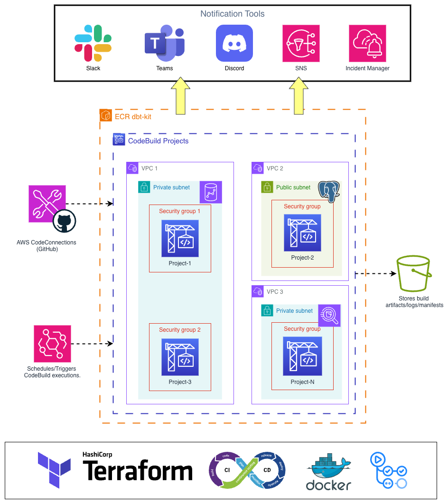

DbtBuildKit Documentation
=========================

.. raw:: html

   

   
   

**DbtBuildKit** eliminates infrastructure complexity for data teams. Instead of wasting time configuring ECR, GitHub connections, CI/CD pipelines, IAM permissions, and monitoring, you simply define your dbt project and DbtBuildKit automatically provisions all necessary infrastructure on AWS.

**Your team can focus 100% on what really matters: developing and maintaining dbt projects.**

What is DbtBuildKit?
--------------------

DbtBuildKit is a Terraform-based infrastructure solution that automatically provisions a complete AWS infrastructure for running dbt projects. It handles:

* **ECR repositories** for Docker images with optimized configurations
* **GitHub integration** via AWS CodeConnections
* **CodeBuild projects** for dbt execution
* **CI/CD pipelines** with reusable GitHub Actions workflows
* **IAM roles and permissions** with configurable security policies
* **CloudWatch scheduling** for automated execution
* **Multi-channel notifications** (Slack, Teams, Discord)
* **Elementary Data integration** for advanced monitoring
* **Incident management** via AWS Systems Manager

Key Features
------------

dbtbuildkit Module
~~~~~~~~~~~~~~~~~~

* Automatic ECR repository creation with optimized configurations
* Native GitHub integration via AWS CodeConnections
* Automatic Docker image builds with pre-configured DbtBuildKit
* Automatic GitHub connection approval with configurable timeout
* Lifecycle policies for image management
* Security scanning of images on push
* Self-contained module - all logic integrated, no external dependencies

dbt Module
~~~~~~~~~~

* Automatic CodeBuild project creation based on YAML file
* Multi-environment support (dev, stg, prd)
* Execution scheduling via CloudWatch Events (cron and rate)
* Native GitHub integration or SSH as fallback
* Multiple engine support: Athena, Redshift, BigQuery, Snowflake, etc.
* Multi-channel notifications: Slack, Microsoft Teams, Discord
* Elementary Data integration for advanced monitoring
* Incident management via AWS Systems Manager
* Configurable IAM permissions (minimal or broad policies)
* VPC support for private network execution
* Environment variables and AWS Secrets Manager secrets
* Configurable S3 artifacts
* Customizable timeout and compute type

Quick Start
-----------

New to DbtBuildKit? Start here:

* :doc:`quickstart` - Get up and running in minutes

The quick start guide will walk you through:

* Prerequisites and installation
* Automatic CI/CD setup (recommended)
* Manual setup option
* Your first dbt project configuration
* Common issues and solutions

Documentation Contents
----------------------

.. toctree::
   :maxdepth: 2
   :caption: Documentation:

   quickstart
   examples
   modules/dbt
   modules/dbtbuildkit
   cicd

Architecture Overview
---------------------

   
   Architecture diagram showing the complete DbtBuildKit infrastructure on AWS

DbtBuildKit automatically provisions a complete infrastructure on AWS with the following components:

**Core Infrastructure:**

* **ECR Repository**: Stores Docker images with pre-configured DbtBuildKit
* **GitHub Connection**: Native integration via AWS CodeConnections
* **CodeBuild Projects**: One or more projects for executing dbt commands
* **CloudWatch Events**: Scheduling and automation triggers
* **S3 Buckets**: Storage for build artifacts and logs
* **IAM Roles**: Secure permissions for CodeBuild execution
* **Notifications**: Multi-channel alerts (Slack, Teams, Discord)

**Component Relationships:**

* ECR repository provides Docker images to all CodeBuild projects
* GitHub connection enables CodeBuild to access your repositories
* CloudWatch Events triggers scheduled executions
* CodeBuild projects execute dbt commands and store artifacts in S3
* Notifications are sent based on build results

Execution Flow
~~~~~~~~~~~~~~

1. **Provisioning**: Terraform creates ECR, GitHub Connection, and CodeBuild projects
2. **Build**: Docker image is built and pushed to ECR automatically
3. **Scheduling**: CloudWatch Events triggers executions according to configuration
4. **Execution**: CodeBuild executes dbt commands using the Docker image
5. **Notifications**: Results are sent to configured channels
6. **Monitoring**: Elementary Data and CloudWatch logs for observability

Prerequisites
-------------

Before starting, make sure you have:

* **AWS Account** with adequate permissions to create resources
* **Terraform** installed (version >= 1.0)
* **AWS CLI** configured with valid credentials
* **GitHub access** (organization or repositories)
* **Basic knowledge** of Terraform and dbt (optional, but recommended)

Required AWS Permissions
~~~~~~~~~~~~~~~~~~~~~~~~

The user/role running Terraform needs permissions for:

* ECR (create repositories, push/pull images)
* CodeBuild (create projects, roles, policies)
* CodeConnections (create GitHub connections)
* IAM (create roles and policies)
* CloudWatch Events (create scheduling rules)
* S3 (create buckets for artifacts)
* Secrets Manager (if using secrets)

Automatic CI/CD Setup
---------------------

DbtBuildKit includes reusable GitHub Actions workflows that automatically configure all CI/CD infrastructure. This feature eliminates the need to manually configure S3 buckets, IAM roles, and OIDC providers.

Features:

* **Automatic setup** of base infrastructure
* **Reusable workflows** for Terraform (plan, apply)
* **Multi-environment support** (dev, stg, prd)
* **OIDC authentication** (no permanent credentials)
* **Ready-to-use examples**

See :doc:`cicd` for complete CI/CD setup documentation.

Examples
--------

DbtBuildKit provides comprehensive examples for various use cases:

* Basic setup and configuration
* Scheduled execution
* Notifications setup
* Advanced IAM policies
* VPC configuration
* Multi-environment deployments

See :doc:`examples` for detailed examples and use cases.

Getting Help
------------

* **Documentation**: Browse the documentation sections above
* **Issues**: Report issues on `GitHub Issues <https://github.com/dbtbuildkit/dbtbuildkit-infra/issues>`_
* **Discussions**: Ask questions on `GitHub Discussions <https://github.com/dbtbuildkit/dbtbuildkit-infra/discussions>`_

Version
-------

Current version: **0.1.0**

See the `VERSION <https://github.com/dbtbuildkit/dbtbuildkit-infra/blob/main/VERSION>`_ file for the latest version.

License
-------

This project is licensed under [specify license]. See the LICENSE file for more details.

---

**Developed to simplify the lives of data teams**
